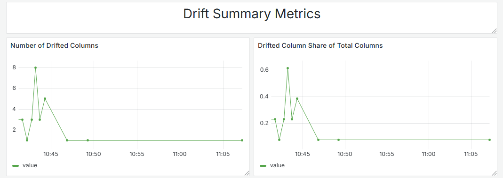
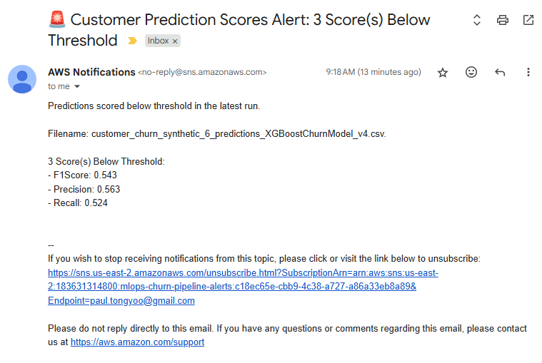

# Churn Prediction Model Evaluation Platform

(For those evaluating this project for the [DataTalks.club MLOps Zoomcamp certification](https://datatalks.club/blog/mlops-zoomcamp.html), see the [**"DataTalks.club MLOps Zoomcamp Evaluation Criteria" section**](#datatalksclub-mlops-zoomcamp-evaluation-criteria) for mappings between this document's sections and each criteria.)

## Table of Contents

1. [Problem Statement](#problem-statement)
2. [Customer Churn Data Source](#customer-churn-data-source)
3. [Platform Processes](#platform-processes)
   - [Model Training and Registry Deployment](#model-training-and-registry-deployment)
   - [Model Inference, Reporting, and Evaluation](#model-inference-reporting-and-evaluation)
4. [Platform Infrastructure Diagram](#platform-infrastructure-diagram)
5. [S3 File Drop Folder Structure](#s3-file-drop-folder-structure)
6. [Project Folders & Files](#project-folders--files)
7. [Installation Prerequisites](#installation-prerequisites)
8. [Docker Local Image Storage Space Requirements](#docker-local-image-storage-space-requirements)
9. [Library Dependencies & Version Numbers](#library-dependencies--version-numbers)
10. [How to Install Platform](#how-to-install-platform)
11. [Platform ECS Services](#platform-ecs-services)
    - [MLFlow Tracking Server & Model Registry](#mlflow-tracking-server--model-registry)
    - [Prefect Orchestration Server and Worker Service](#prefect-orchestration-server-and-worker-service)
    - [Evidently Non-Time-Series Dashboard and Reports UI](#evidently-non-time-series-dashboard-and-reports-ui)
    - [Grafana Time-Series Dashboard UI](#grafana-time-series-dashboard-ui)
12. [How to Upload Data](#how-to-upload-data)
13. [How to Evaluate Data Drift & Model](#how-to-evaluate-data-drift--model)
14. [Data Drift & Prediction Score Email Alerts](#data-drift--prediction-score-email-alerts)
15. [Unit Test Examples](#unit-test-examples)
16. [Integration Test Examples](#integration-test-examples)
17. [Pre-Commit Hooks](#pre-commit-hooks)
18. [Makefile Targets](#makefile-targets)
19. [CI-CD Implementation](#ci-cd-implementation)
20. [DataTalks.club MLOps Zoomcamp Evaluation Criteria](#datatalksclub-mlops-zoomcamp-evaluation-criteria)


## Problem Statement

* Companies rely on churn prediction models to proactively retain valuable customers--an effort that is typically more cost-effective than acquiring new ones.
* However, once deployed, these models risk losing accuracy over time as customer behavior and demographics shift.
* This project addresses this challenge by providing Data Scientists, Machine Learning Engineers, and Machine Learning Operations Engineers a platform to continuously train, deploy, and evaluate churn models, enabling teams to detect drift, maintain model quality, and adapt to changing customer dynamics.

## Customer Churn Data Source

* The labeled customer churn data used to train the model was randomly collected from an Iranian telecom company on 4/8/2020 and made available to download by the UC Irvine Machine Learning Repository at https://archive.ics.uci.edu/dataset/563/iranian+churn+dataset .
* The `mlops-churn-pipeline` repository contains a `data` folder with several CSV files prefixed with the string `customer_churn_*`.
* The following files were split from the original Iranian Telecom dataset:
   * `customer_churn_0.csv`
   * `customer_churn_1.csv`
   * `customer_churn_2_majority_drifted.csv`
* The `customer_churn_synthetic_*.csv` files were generated by Gretel.ai using the `customer_churn_0/1/2*.csv` files as input.

## Platform Processes

### Model Training and Registry Deployment 

The following process is implemented with two files inside the `code/orchestration/modeling` folder:
* **Jupyter Notebook:** `code/orchestration/modeling/churn_model_training.ipynb`
	* Main location for EDA, hyperparameter tuning, and calling upon `modeling.churn_model_training` functions below
* **Python Module:** `code/orchestration/modeling/churn_model_training.py`
	* Contains functions used in both Jupyter Notebook and in Prefect Flow `churn_prediction_pipeline.py` (see [Model Inference, Reporting, and Evaluation](#model-inference-reporting-and-evaluation) section below)


### Model Inference, Reporting, and Evaluation

* The following pipeline is orchestrated by a Prefect Flow implemented by `code/orchestration/churn_prediction_pipeline.py`.
* It is invoked for each file dropped into the S3 File Drop Folder `input` folder (see [S3 File Drop Folder Structure](#s3-file-drop-folder-structure)).


## Platform Infrastructure Diagram


## S3 File Drop Folder Structure

<pre>
s3://mlops-churn-pipeline
└── data
    ├── input        # Customer churn files uploaded here
    ├── processing   # File moved here during processing
    ├── logs         # Log file created for each dropped file
    ├── processed    # Files moved here on successful processing
    └── errored      # Files moved here if error occurred during processing
</pre>

## Project Folders & Files

This project consists mainly of the following folders and files:
* `code/grafana/`
  * Contains Dockerfile that packages Grafana Enterprise image with:
     * `grafana-postgres-datasource.yml`: Postgres Data Source configuration 
     * `churn-model-evaluation.json`: Pre-created Data Drift and Prediction Score Evaluation Dashboard 
* `code/orchestration/`
   * Contains Dockerfile that packages Prefect Flow pipeline consisting of:
      * `churn_prediction_pipeline.py`: Contains main Prefect flow and tasks
      * `modeling/`
         * Contains model training and registry deployment logic:
            * `churn_model_training.ipynb` for model EDA, hyperparameter tuning, and model training
            * `churn_model_training.py` for extracting training logic to reuse in Prefect pipeline
      * `tests/`
         * `unit/`
            * Contains unit tests using `unittest.MagicMock` to mock all dependencies
         * `integration/`
            * Contains integration tests utilizing `testcontainer[localstack]` to mock AWS component with LocalStack equivalent
* `code/s3_to_prefect_lambda/`
	* Contains Dockerfile that packages `lambda_function.py` and its dependencies for notifying Prefect pipeline of new file drops
* `data/`
   * These files were split from the original data set: 
      * `customer_churn_0.csv`: File used to drain model
      * `customer_churn_1.csv`
      * `customer_churn_2_majority_drifted.csv`: File that exhibits data drift exceeding threshold (email notification will be sent)
   * `customer_churn_synthetic_*.csv`: Generated using [Gretel.ai](https://gretel.ai)
* `terraform/`
   * Contains Infrastructure-as-Code (IaC) and scripts to configure or destroy 80+ AWS resources from single command
      * `modules/`: Configures the following AWS Services:
         * `alb/`: [AWS Application Load Balancer](https://aws.amazon.com/elasticloadbalancing/application-load-balancer/)
         * `ecr/`: [AWS Elastic Container Registry](https://aws.amazon.com/ecr/)
         * `ecs/`: [AWS Elastic Container Service](https://aws.amazon.com/ecs/)
         * `rds-postgres/`: [AWS Relational Database Service](https://aws.amazon.com/rds/)
         * `s3/`: [AWS Simple Storage Service](https://aws.amazon.com/s3/)
         * `s3-to-prefect-lambda/`: [AWS Lambda](https://aws.amazon.com/lambda/)
         * `sns/`: [AWS Simple Notification Service](https://aws.amazon.com/sns/)
      * `scripts/`
         * `store_prefect_secrets.py`: Stores generated ALB endpoints and SNS topic ARN into Prefect Server for use by pipeline
         * `wait-for-services.sh`: Used to wait for [Platform ECS Services](#platform-ecs-services) to become available via ALB before returning UI URLs to user
      * `vars/`
         * `stg.tfvars.template`: Base file for creating your own `stg.tfvars` (see [How to Set Up Platform](#how-to-set-up-platform))
* `readme-assets/`
   * Screenshots for this readme
* `.env`
   * Contains the URLs for:
      * MLFlow, Prefect, Evidently, and Grafana
      * Prefect Server API
* `Makefile`
   * Contains several targets to accelerate platform setup, development, and testing (see [Makefile Targets](#makefile-targets) section
* `upload_simulation_script.py`
   * Script that helps generate metrics over time for viewing in Grafana UI
   * Uploads the non-training data files into S3 File Drop Input folder 30 seconds apart

### Full Project Folder Tree
<pre>
.
├── code
│   ├── grafana
│   │   ├── dashboards
│   │   │   └── churn-model-evaluation.json
│   │   ├── provisioning
│   │   │   ├── dashboards
│   │   │   │   └── default.yml
│   │   │   └── datasources
│   │   │       └── grafana-postgres-datasource.yml
│   │   ├── Dockerfile
│   │   └── custom.ini
│   ├── orchestration
│   │   ├── modeling
│   │   │   ├── __init__.py
│   │   │   ├── churn_model_training.ipynb
│   │   │   ├── churn_model_training.py
│   │   │   └── setup.py
│   │   ├── tests
│   │   │   ├── integration
│   │   │   │   ├── __init__.py
│   │   │   │   └── test_validate_file_input.py
│   │   │   ├── unit
│   │   │   │   ├── __init__.py
│   │   │   │   ├── test_fetch_model.py
│   │   │   │   ├── test_generate_predictions.py
│   │   │   │   ├── test_move_to_folder.py
│   │   │   │   ├── test_prepare_dataset.py
│   │   │   │   └── test_validate_file_input.py
│   │   │   └── __init__.py
│   │   ├── Dockerfile
│   │   ├── Pipfile
│   │   ├── Pipfile.lock
│   │   ├── __init__.py
│   │   ├── churn_prediction_pipeline.py
│   │   ├── prefect.yaml
│   │   └── update_prefect_yaml.py
│   ├── s3_to_prefect_lambda
│   │   ├── Dockerfile
│   │   ├── Pipfile
│   │   ├── Pipfile.lock
│   │   ├── __init__.py
│   │   └── lambda_function.py
│   └── __init__.py
├── data
│   ├── customer_churn_0.csv
│   ├── customer_churn_1.csv
│   ├── customer_churn_2_majority_drifted.csv
│   ├── customer_churn_synthetic_1.csv
│   ├── customer_churn_synthetic_2.csv
│   ├── customer_churn_synthetic_3.csv
│   ├── customer_churn_synthetic_4_scores_below_threshold.csv
│   ├── customer_churn_synthetic_5.csv
│   └── customer_churn_synthetic_6.csv
├── infrastructure
│   ├── modules
│   │   ├── alb
│   │   │   ├── main.tf
│   │   │   ├── outputs.tf
│   │   │   └── variables.tf
│   │   ├── ecr
│   │   │   ├── main.tf
│   │   │   ├── outputs.tf
│   │   │   └── variables.tf
│   │   ├── ecs
│   │   │   ├── main.tf
│   │   │   ├── outputs.tf
│   │   │   └── variables.tf
│   │   ├── rds-postgres
│   │   │   ├── main.tf
│   │   │   ├── outputs.tf
│   │   │   └── variables.tf
│   │   ├── s3
│   │   │   ├── main.tf
│   │   │   ├── outputs.tf
│   │   │   └── variables.tf
│   │   ├── s3-to-prefect-lambda
│   │   │   ├── main.tf
│   │   │   └── variables.tf
│   │   └── sns
│   │       ├── main.tf
│   │       ├── outputs.tf
│   │       └── variables.tf
│   ├── scripts
│   │   ├── store_prefect_secrets.py
│   │   └── wait-for-services.sh
│   ├── vars
│   │   └── stg.tfvars.template
│   ├── main.tf
│   └── variables.tf
├── readme-assets
│   ├── email-alert-data-drift.png
│   ├── email-alert-scores-below-threshold.png
│   ├── evidently-confusion-matrix-by-label.png
│   ├── evidently-confusion-matrix.png
│   ├── evidently-data-drift-detailed.png
│   ├── evidently-data-drift-summary.png
│   ├── evidently-model-performance.png
│   ├── grafana-drift-summary-metrics.png
│   ├── grafana-latest-prediction-scores.png
│   ├── grafana-metric-drift-p-values.png
│   ├── mlflow-artifacts.png
│   ├── mlflow-confusion-matrix.png
│   ├── mlflow-experiments.png
│   ├── mlflow-model-details.png
│   ├── mlflow-model-registry.png
│   ├── pipeline_ecs_tasks.png
│   ├── prefect-dashboard.png
│   ├── prefect-deployments.png
│   ├── prefect-flows.png
│   ├── prefect-run-detail.png
│   ├── prefect-runs.png
│   └── prefect-work-pools.png
├── .gitignore
├── .pre-commit-config.template.yaml
├── .python-version
├── Makefile
├── README.md
├── folder-structure.txt
├── pyproject.toml
├── pytest.ini
└── upload_simulation_script.py


</pre>
## Installation Prerequisites

* Python 3.10.x
* [AWS Account](https://aws.amazon.com/)
    * AWS Account required to deploy the pipeline to the cloud and run it as a user
    * AWS Account NOT required to run unit and integration tests
* AWS User with the [Required IAM Permissions](#required-iam-permissions) policies
* [AWS CLI](https://docs.aws.amazon.com/cli/latest/userguide/cli-chap-getting-started.html) installed with `aws configure` run to store AWS credentials locally
* [Docker](https://docs.docker.com/get-started/get-docker/) installed and Docker Engine running
* [Pip](https://pip.pypa.io/en/stable/installation/) and [Pipenv](https://pipenv.pypa.io/en/latest/) 
* [Terraform](https://developer.hashicorp.com/terraform/install) 
* [Prefect](https://docs.prefect.io/v3/get-started/install) 
* [Pre-commit](https://pre-commit.com/#install) 
* GitHub Account
  * At this time, committing repo to your GitHub account and running GitHub Actions workflow is the only way to deploy Prefect flow to Prefect Server (without manual effort to circumvent)
 
### Required IAM Permissions

A user with the following AWS Managed Permissions policies was used when creating this Platform.  **Please note that this list is *overly-permissive* and may be updated in the future.**

* `AmazonEC2ContainerRegistryFullAccess`
* `AmazonEC2FullAccess`
* `AmazonECS_FullAccess`
* `AmazonRDSFullAccess`
* `AmazonS3FullAccess`
* `AmazonSNSFullAccess`
* `AmazonLambda_FullAccess`
* `CloudWatchLogsFullAccess`
* `IAMFullAccess`

## Docker Local Image Storage Space Requirements

 About 1.8GB of disk space is required to store the following Docker images locally before deploying to AWS Elastic Container Repositories (ECR):
* **Custom Grafana Image**
    * Packages database configuration and dashboard files
    * Uses Grafana `grafana/grafana-enterprise:12.0.2-security-01` image
* **S3-to-Prefect Lambda Function**
    * Invokes orchestration flow when new files are dropped into S3
    * Uses AWS `public.ecr.aws/lambda/python:3.12` image
 
Don't forget to delete these images when finished with this platform!

## Library Dependencies & Version Numbers

See the `Pipfile` and `Pipfile.lock` files within the following folders for the full lists of library dependencies and version numbers used:

* `code/orchestration/`
* `code/s3_to_prefect_lambda/`

## How to Install Platform

1.  Install the [prerequisites](#installation-prerequisites)
1.  Create an S3 bucket to store the state of your Terraform infrastructure (e.g. `mlops-churn-pipeline-tf-state-<some random number>`)
1.  Clone `mlops-churn-pipeline` repository locally
1.  Edit root Terraform configuration to store state within S3
    1.  Edit file: `{REPO_DIR}/infrastructure/main.tf`
    1.  Change `terraform.backend.s3.bucket` to the name of the bucket you created
    1.  Change `terraform.backend.s3.region` to your AWS region
1.  Copy Terraform `infrastructure/vars/stg.template.tfvars` file to new `infrastructure/vars/stg.tfvars` file and define values for each key within:

| **Key Name** | **Purpose** | **Example Value** |
| ------------ | ----------- | ----------------- |
| `project_id` | Used as prefix for many AWS resources, including the S3 bucket while files will be dropped and generated.  **Must be a valid S3 name (e.g. unique, no underscores).  Must be 20 characters or less to prevent exceeding resource naming character limits.**   | `mlops-churn-pipeline` |
| `vpc_id` | Your AWS VPC ID | `vpc-0a1b2c3d4e5f6g7h8` |
| `aws_region` | Your AWS Region | `us-east-2` |
| `db_username` | Username for Postgres database used to store MLflow, Prefect, and Evidently Metrics.  Must conform to Postgres rules (e.g. lowercase, numbers, underscores only) | `my_super_secure_db_name` |
| `db_password` | Password for Postgres database. Use best practices and avoid spaces. | `Th1s1sAStr0ng#Pwd!` |
| `grafana_admin_user` | Username for Grafana account used to **edit** data drift and model prediction scores over time.  | `grafana_FTW` |
| `grafana_admin_password` | Password for Grafana account | `Grafana4Lyfe!123` |
| `subnet_ids`  | AWS Subnet IDs: **Must be *public* subnet IDs to allow Postgres RDS instance to be accessed by ECS services (and optionally your IP address)** | `["subnet-123abc456def78901", "subnet-234bcd567efg89012"]` |
| `my_ip` | IP address that will be granted access to Grafana UI and Postgres DB | `203.0.113.42` |
| `my_email_address` | Email address that will be notified if input files exhibit data drift or prediction scores that exceed thresholds | `your.name@example.com` |

1.  `cd {REPO_DIR}/infrastructure` then `terraform init`.  If successful, this command will populate the Terraform State S3 bucket you created in Step 2 with the necessary files to capture the state of your infrastructure across Terraform command invocations.
2.  `cd {REPO_DIR}/code/orchestration` then `pipenv shell`
3.  `cd {REPO_DIR}`
1.  Run `make plan` and review the infrastructure to be created (see [Platform Infrastructure Diagram](#platform-infrastructure-diagram)
1.  Run `make apply` to build Terraform infrastructure, set Prefect Secrets, update GitHub Actions workflow YAML, and start ECS services.
    1.  After Terraform completes instantiating each ECS Service, it will execute the `wait_for_services.sh` script to poll the ALB URLs until each service instantiates its ECS Task and the service is ready for use.
    1.  For the user's convenience, each tool's URL is displayed to the user once ready for use (see [Platform ECS Services](#platform-ecs-services)).
1.  Click each of the 4 ECS Service URLs to confirm they are running: MLFlow, Prefect Server, Evidently, Grafana
1.  Run `make register-model` to train `XGBoostChurnModel` churn model and upload it to the MLFlow Model Registry with `staging` alias.
    1.  Confirm it was created by visiting the Model Registry within the MLFlow UI
1.  Deploy the `churn_prediction_pipeline` Prefect Flow to your Prefect Server using GitHub Actions
    1. Commit your cloned repo (including `{REPO_DIR}/.github/workflows/deploy-prefect.yml` updated with generated `PREFECT_API_URL`)
    1. Log in your GitHub account, navigate to your committed repo project and create the following Repository Secrets (used by `deploy-prefect.yml`):
        1.  `AWS_ACCOUNT_ID`
        1.  `AWS_ACCESS_KEY_ID`
        1.  `AWS_SECRET_ACCESS_KEY`
        1.  `AWS_REGION`
    1.  Nagivate to GitHub Project Actions tab, select the workflow `Build and Deploy Prefect Flow to ECR`, and verify it completes successfully.
2.  Confirm your email subscription to the pipeline SNS topic
  3.  Navigate to your email inbox and look for an email subject titled `AWS Notification - Subscription Confirmation`.
  4.  Open the email and click the `Confirm Subscription` link within.
  5.  You should subsequently see a green message relaying your subscription has been confirmed.

## Platform ECS Services

Once the Terraform `make apply` command completes successfully, you should see output similar to the following that provides you URLs to each of the 4 tools created:
```
🎉 All systems go! 🎉

MLflow, Prefect, Evidently, and Grafana UI URLs
-----------------------------------------------

🧪 MLflow UI: http://mlops-churn-pipeline-alb-123456789.us-east-2.elb.amazonaws.com:5000
⚙️ Prefect UI: http://mlops-churn-pipeline-alb-123456789.us-east-2.elb.amazonaws.com:4200
📈 Evidently UI: http://mlops-churn-pipeline-alb-123456789.us-east-2.elb.amazonaws.com:8000
📈 Grafana UI: http://mlops-churn-pipeline-alb-123456789.us-east-2.elb.amazonaws.com:3000
```

Clicking on each URL should render each tool's UI successfully in your browser (the Terraform command includes invoking a script that polls the services' URLs until they return successful responses).

If any of the URLs return an error (e.g. 503 Service Unavailable), log into the AWS Elastic Container Service (ECS) console and confirm an ECS Task is in Running state for each of the 4 services (see screenshot below).


 

These URLs were also written to the `{REPO_DIR}/.env` file for future retrieval and export to shell environment when needed.

```
MLFLOW_TRACKING_URI=http://mlops-churn-pipeline-alb-123456789.us-east-2.elb.amazonaws.com:5000
PREFECT_API_URL=http://mlops-churn-pipeline-alb-123456789.us-east-2.elb.amazonaws.com:4200/api
EVIDENTLY_UI_URL=http://mlops-churn-pipeline-alb-123456789.us-east-2.elb.amazonaws.com:8000
PREFECT_UI_URL=http://mlops-churn-pipeline-alb-123456789.us-east-2.elb.amazonaws.com:4200
GRAFANA_UI_URL=http://mlops-churn-pipeline-alb-123456789.us-east-2.elb.amazonaws.com:3000
```

The following sections give a brief overview of the tool features made available in this project:

### MLFlow Tracking Server & Model Registry
* List model experiment runs that track model metrics and parameters used
* Captures details of each experiment run, including model type and training dataset used
* Automatically creates images to aid evaluation (e.g. confusion matrix, SHAP summary plot)
* Store models in Model Registry for future use (e.g. loaded by Model Evaluation Pipeline on file drop)
  
 <br>


### Prefect Orchestration Server and Worker Service

Translates Python scripts into robust, scalable, observable orchestrations.


### Evidently Non-Time-Series Dashboard and Reports UI

Provides detailed data drift and model performance metrics for individual file drops.


### Grafana Time-Series Dashboard UI

Provides a pre-created dashboard plotting model data drift and performance metrics over time.





## How to Upload Data 

1. Navigate to `{REPO_DIR}` (and run `cd {REPO/HOME}code/orchestration && pipenv shell` if you haven't already)
2. You can process the labeled Customer Churn data in one of two ways:

   1. Use `upload_simulation_script.py` script to upload non-training data files 30-seconds apart to [S3 File Drop `input` Folder](#s3-file-drop-folder-structure)

      i. Edit `upload_simulation_script.py` to change the `BUCKET_NAME` value to match what you configured in `stg.tfvars`  
      ii. Run `make simulate-file-drops` from `{REPO_DIR}` to run the script `upload_simulation_script.py` which uploads each file in the `data` folder (except `customer_churn_0.csv`) to the S3 bucket folder

   2. Manually upload files from the `{REPO_DIR}/data` folder into the S3 bucket `{PROJECT_ID}/data/input` folder


## How to Evaluate Data Drift & Model

Once your files have completed processing (as visible via Prefect UI or seeing them appear in S3 `data/processed/` folder), you can evaluate their data in two ways:

1.  Navigate to the Evidently UI to view detailed data drift metrics and prediction scores for each file
2.  Navigate to the Grafana UI and view the precreated **"Customer Churn Model Evaluation"** dashboard to view how the drift metrics and prediction scores have behaved over time

## Data Drift & Prediction Score Email Alerts

The pipeline will send an email to the address configured within `stg.tfvars` in each of the following scenarios:

### Data Drift Alert
Sent if Evidently finds more than 50% of the new customer data set columns have drifted from the reference data set:


### Prediction Score Alert
Sent if Evidently reports any of the observed prediction scores drop below 70%:
* F1 Score
* Precision
* Recall
* Accuracy



## Unit Test Examples

Example unit tests can be found within the `code/orchestration/tests/unit/` folder for select Prefect @task functions of `churn_prediction_pipeline.py`.

The `unittest.TestCase`, `unittest.mock.Patch`, and `unittest.mock.MagicMock` classes were used to create reused test fixture code that overrode ("patch"-ed) class object references with mock objects.

<pre>
├── code
│   ├── orchestration
│   │   ├── tests
│   │   │   ├── unit
│   │   │   │   ├── test_fetch_model.py
│   │   │   │   ├── test_generate_predictions.py
│   │   │   │   ├── test_move_to_folder.py
│   │   │   │   ├── test_prepare_dataset.py
│   │   │   │   └── test_validate_file_input.py
|   |   └── churn_prediction_pipeline.py
</pre>


## Integration Test Examples

Example integration tests can be found within the `code/orchestration/tests/integration/` folder for the `validate_file_input` @task function of `churn_prediction_pipeline.py`.

In order to integration test the function is correctly reading files from S3, the [`testcontainers.localstack` module](https://testcontainers-python.readthedocs.io/en/latest/modules/localstack/README.html) was used to dynamically create a LocalStack container that served as a mock S3 endpoint for the `s3_client` calls made by the `validate_file_input` function.

<pre>
├── code
│   ├── orchestration
│   │   ├── tests
│   │   │   ├── integration
│   │   │   │   └── test_validate_file_input.py
|   |   └── churn_prediction_pipeline.py
</pre>

## Pre-Commit Hooks

The following hooks are used to maintain notebook and module code quality and execute tests prior to commiting files to Git:

* `nbqa-pylint`
* `nbqa-flake8`
* `nbqa-black`
* `nbqa-isort`
* `trailing-whitespace`
* `end-of-file-fixer`
* `check-yaml`
* `check-added-large-files`
* `isort`
* `black`
* `pylint`
* `pytest-check`

## Makefile Targets

The following table lists the `make` targets available to accelerate platform deployment, development, and testing:
| Target Name | Purpose |
| ------------| ------- |
| `test` | Runs all unit and integration tests defined within `code/orchestration` and `code/s3_to_prefect_lambda` folders |
| `quality` | Runs `pre-commit run --all-files`.  See [Pre-Commit Hooks](#pre-commit-hooks) |
| `commit` | Stages all changed files, prompts user for commit message, and attempts to commit the files (barring pre-commit errors) |
| `plan` | Runs `terraform plan --var-file=vars/stg.tfvars` from `infrastructure` directory |
| `apply` | Runs `terraform apply --var-file=vars/stg.tfvars --auto-approve` and outputs emoji-filled message with UI URLs upon successful deploy and ECS Task activation |
| `destroy` | Runs `terraform destroy -var-file=vars/stg.tfvars --auto-approve` |
| `disable-lambda` | Used to facilitate local dev/testing: Disables notification of the `s3_to_prefect` Lambda function so files aren't automatically picked up by the deployed service.  Lets you run the pipeline locally for development and debugging. |
| `enable-lambda` | Re-enables the `s3_to_prefect` Lambda notification to resume pipeline instantiaton on S3 file drop |
| `register-model` | Executes the `churn_model_training.py` file to train and deploy two models to the MLFlow Registry (evaluated on training and holdout data, respectively).  The second model is assigned the `staging` alias to allow the Prefect pipeline to fetch the latest `staging` model without code changes. |
| `process-test-data` | Use to manually invoke flow after running `disable-lambda` target.  Assumes `customer_churn_1.csv` was uploaded into the S3 `data/input/` folder.  Runs command `python churn_prediction_pipeline.py mlops-churn-pipeline data/input/customer_churn_1.csv` and instantiates local Prefect Server to execute flow. |
| `simulate-file-drops` | Runs `upload_simulation_script.py` to automatically upload each non-training data file in the `data/` folder to the S3 File Drop input folder.  **Edit `upload_simulation_script.py` to change the `BUCKET_NAME` value to match what you configured in `stg.tfvars`.** |

## CI-CD Implementation

GitHub Actions was used to execute the following Continuous integration and Continuous Delivery (CI/CD) process.  See `.github/workflows/deploy-prefect.yml` for details.


## DataTalks.club MLOps Zoomcamp Evaluation Criteria
Source: https://github.com/DataTalksClub/mlops-zoomcamp/tree/main/07-project

### Problem description
#### Target: The problem is well described and it's clear what the problem the project solves
See [Problem Statement](#problem-statement) section.

### Cloud
#### Target: The project is developed on the cloud and IaC tools are used for provisioning the infrastructure
* See [Project Folders & Files](#project-folders--files) section for summary of Terraform files used to create AWS infrastructure.
* See [Platform Infrastructure Diagram](#platform-infrastructure-diagram) for diagram of cloud resources created and collaborations for each.

### Experiment tracking and model registry
#### Target: Both experiment tracking and model registry are used
See [MLFlow Tracking Server & Model Registry](#mlflow-tracking-server--model-registry) section for screenshots of experiments tracked and model stored in registry.

### Workflow orchestration
#### Target: Fully deployed workflow 
See [Prefect Orchestration Server and Worker Service](#prefect-orchestration-server-and-worker-service) section for screenshots of fully deployed workflow within Prefect UI and examples of worflow executions ("runs").

### Model deployment
#### Target: The model deployment code is containerized and could be deployed to cloud or special tools for model deployment are used
See the `orchestration` and `s3_to_prefect_lambda` folders of [Project Folders & Files](#project-folders--files) to see how the model deployment code was containerized and deployed to the cloud.

### Model monitoring
#### Target: Comprehensive model monitoring that sends alerts or runs a conditional workflow (e.g. retraining, generating debugging dashboard, switching to a different model) if the defined metrics threshold is violated
See [Data Drift & Prediction Score Email Alerts](#data-drift--prediction-score-email-alerts) section for examples of email alerts that are sent when new customer data files exhibit the majority of their columns drifting from reference data or when the model prediction scores drop below pre-defined threshold.

### Reproducibility
#### Target: Instructions are clear, it's easy to run the code, and it works. The versions for all the dependencies are specified.
* See [How to Set Up Platform](#how-to-set-up-platform) section for instructions on how to set up the platform.
* See [Library Dependencies & Version Numbers](#library-dependencies--version-numbers) section for instructions on how to determine libraries used and their verision numbers.

### Best practices
#### Target: There are unit tests (1 point)
See [Unit Test Strategy & Examples](#unit-test-strategy--examples) section for summary of unit tests that were implemented.

#### Target: There is an integration test (1 point)
See [Integration Test Strategy & Examples](#integration-test-strategy--examples) section for summary of integration tests that were implemented.

#### Target: Linter and/or code formatter are used (1 point)
See [Pre-Commit Hooks](#pre-commit-hooks) section to see which linter and code formatters were used.

#### Target: There's a Makefile (1 point)
See [Makefile Targets](#makefile-targets) section for list of `Makefile` targets that were implemented.

#### Target: There are pre-commit hooks (1 point)
See [Pre-Commit Hooks](#pre-commit-hooks) section to see which hooks were used.

#### Target: There's a CI/CD pipeline (2 points)
See [CI-CD Implementation](#ci-cd-implementation) section for summary of how CI/CD was implemented.
